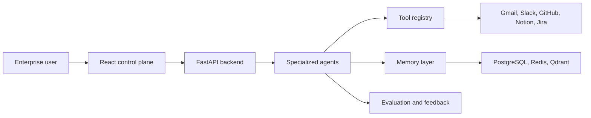

# Enterprise AI Operating System

A portfolio-grade full-stack AI engineering project that models how an enterprise could run specialized AI agents with tool access, memory, cost tracking, feedback, and a roadmap toward MCP, hybrid search, evaluations, and observability.

Live portfolio site: `https://divyadhole.github.io/enterprise-ai-os/`

Backend docs when running locally: `http://localhost:8000/docs`

## Why This Project Exists

Modern AI startups are hiring for engineers who can build more than a chatbot. This project is designed to demonstrate product thinking and applied AI engineering across:

- Multi-agent workflows
- Tool calling and enterprise connector design
- API-first backend development
- React control-plane UI design
- Cost, latency, and feedback tracking
- Search, RAG, MCP, evaluation, and observability roadmap planning
- Docker, CI, and deployment readiness

## Product Snapshot

The app is an enterprise AI control plane where a user can:

- Select a specialized agent: Research, Coding, SQL, Email, or Meeting.
- Route a task through enterprise tools such as Gmail, Calendar, Slack, GitHub, Notion, Jira, and PostgreSQL.
- Inspect short-term and long-term agent memory.
- Run a task and view latency, cost, tool usage, and generated output.
- Use the portfolio demo without a backend, while still supporting the FastAPI backend locally.

## Tech Stack

| Layer | Tools |
| --- | --- |
| Frontend | React, TypeScript, Vite, CSS, lucide-react |
| Backend | Python, FastAPI, Pydantic |
| Data Roadmap | PostgreSQL, Redis, Qdrant |
| AI Roadmap | OpenAI, Anthropic, LangGraph, MCP, hybrid RAG |
| DevOps | Docker Compose, Kubernetes starter manifests, GitHub Actions |
| Quality | Pytest, TypeScript production build |

## Architecture



## Current Features

- Typed FastAPI endpoints for agents, tools, memory, runs, feedback, and dashboard summary.
- Interactive React dashboard with accessible headings, labels, keyboard focus states, and responsive layout.
- Portfolio demo mode so the public site remains usable without a live backend.
- Mock agent execution with latency, cost, and tool-use reporting.
- Docker Compose setup for backend, frontend, PostgreSQL, Redis, and Qdrant.
- Kubernetes starter manifests for backend deployment.
- CI workflow for backend tests and frontend builds.

## Run Locally

Backend:

```bash
cd backend
python3 -m venv .venv
source .venv/bin/activate
pip install -r requirements.txt
uvicorn app.main:app --reload
```

Frontend:

```bash
cd frontend
npm install
npm run dev
```

Open `http://localhost:5173`.

Full stack with Docker:

```bash
docker compose up --build
```

## API Endpoints

- `GET /`
- `GET /health`
- `GET /api/summary`
- `GET /api/agents`
- `GET /api/tools`
- `GET /api/memory`
- `POST /api/runs`
- `POST /api/feedback`

## Validation

Backend tests:

```bash
cd backend
pytest
```

Frontend build:

```bash
cd frontend
npm run build
```

## Roadmap

### Milestone 2: Real Persistence

- Add SQLAlchemy models and Alembic migrations.
- Persist users, runs, feedback, prompt versions, cost events, and memory records in PostgreSQL.
- Use Redis for short-term run state and job coordination.

### Milestone 3: Agent Orchestration

- Add LangGraph workflows for Research, Coding, SQL, Email, and Meeting agents.
- Add permissions, tool schemas, and human approval checkpoints.
- Add safe read-only SQL execution and query review.

### Milestone 4: Search and RAG

- Add BM25 document search.
- Add Qdrant vector search.
- Build hybrid retrieval with citations, source scoring, and context recall metrics.

### Milestone 5: MCP and Tool Connectors

- Add an MCP-compatible tool registry.
- Implement Gmail, Calendar, Slack, GitHub, Notion, Jira, and SQL adapters.
- Add OAuth-ready connection records and scoped permissions.

### Milestone 6: Evaluation and Observability

- Add prompt versioning, golden datasets, LLM-as-judge checks, and regression reports.
- Add Langfuse and OpenTelemetry traces.
- Track quality, latency, cost, and failure modes by agent and tool.

### Milestone 7: Cloud Deployment

- Deploy frontend as a public portfolio demo.
- Deploy backend API with managed PostgreSQL, Redis, and Qdrant.
- Add environment-specific secrets, monitoring, and release checks.

## Resume Bullet

Built an enterprise AI agent platform with a React control plane and FastAPI backend for specialized agents, enterprise tool routing, memory, cost tracking, feedback capture, Dockerized services, CI, and a roadmap for MCP-compatible connectors, hybrid RAG, evaluations, and observability.
